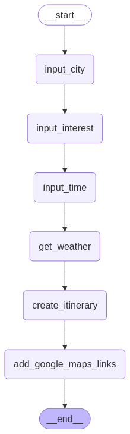

# AI Travel Planner

An AI-powered travel planner built using **LangChain**, **LangGraph**, and **Gradio** with multiple AI agents. This application helps users generate personalized travel itineraries based on their city of choice, interests, and available time, while integrating real-time weather information and Google Maps links.

## 🚀 Features
- **StateGraph**: Defines the flow of the travel planning process.
- **PlannerState**: A custom type representing the current state of planning.
- **Node Functions**: Modular steps handling user input and itinerary generation.
- **Multi-Agent AI System**: Uses multiple AI agents for different tasks.
- **LLM Integration**: Powered by **Llama-3.3-70B-Versatile** for itinerary generation.
- **Gradio Chat Interface**: User-friendly UI for seamless interaction.
- **Real-Time Weather Information**: Fetches weather data for travel planning.
- **Google Maps Links**: Adds navigation support to the itinerary.

## 🔧 Tech Stack
- **LangChain**: For building AI-driven workflows.
- **LangGraph**: To manage the travel planning state graph.
- **Gradio**: For an interactive chat-based user interface.
- **Llama-3.3-70B-Versatile**: For generating personalized itineraries.
- **Weather API**: Fetches weather details for the chosen city.

## 🛠 Workflow
The AI Travel Planner follows a structured workflow with the following steps:




```plaintext
1. input_city  →  User provides the city name.
2. input_interest  →  User specifies their travel interests.
3. input_time  →  User enters the available duration for the trip.
4. get_weather  →  Fetches real-time weather information.
5. add_google_maps_links  →  Generates Google Maps links for key locations.
6. create_itinerary  →  AI generates the final travel itinerary.
```

## 💡 Usage
- Open the Gradio chat interface.
- Enter the city name, interests, and available time.
- The AI fetches weather info, suggests places, and creates an itinerary.
- Get Google Maps links for easy navigation.

## 🎯 Future Improvements
- Integrate hotel and flight booking recommendations.
- Expand support for additional AI models.
- Improve personalization using user history and preferences.
- Add multi-user collaboration for group travel planning.

Happy Traveling! ✈️ 🌎

